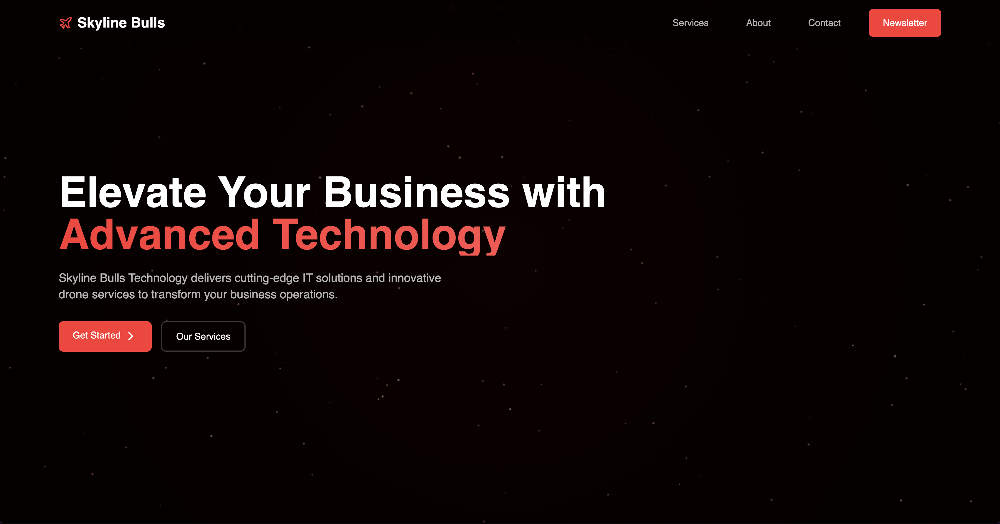

# Skyline Bulls Technology Website

A modern, responsive website showcasing IT services, drone services, and AI solutions. Built with React, TypeScript, and Tailwind CSS.



## Features

- 🎨 Modern, responsive design with dark theme
- 🚀 Smooth animations and transitions
- 📱 Mobile-first approach
- 🔒 Form validation with Zod
- 📬 Newsletter subscription
- 📝 Contact form with spam protection
- 💫 Interactive service cards
- 🎯 Syntax highlighting for code examples
- 🌟 Starry background animation

## Tech Stack

- **Framework:** React with TypeScript
- **Styling:** Tailwind CSS
- **Form Validation:** Zod
- **Icons:** Lucide React
- **Code Highlighting:** Prism.js
- **Deployment:** Vercel

## Getting Started

### Prerequisites

- Node.js (v14 or higher)
- npm or yarn

### Installation

1. Clone the repository:
```bash
git clone https://github.com/yourusername/skylinebulls.com.git
cd skylinebulls.com
```

2. Install dependencies:
```bash
npm install
# or
yarn install
```

3. Start the development server:
```bash
npm run dev
# or
yarn dev
```

4. Open [http://localhost:5173](http://localhost:5173) in your browser.

## Project Structure

```
src/
├── components/
│   ├── CodeBlock.tsx
│   ├── StarryBackground.tsx
│   └── SuccessPopup.tsx
├── styles/
│   └── prism-custom.css
└── App.tsx
```

## Features in Detail

### Contact Form
- Real-time validation
- Spam protection with 30-second cooldown
- Success notifications
- Error handling

### Newsletter Subscription
- Email validation
- Success notifications
- Automatic section hiding after successful subscription

### Service Sections
- Interactive cards with hover effects
- Detailed feature lists
- Responsive grid layouts
- Integration showcases

## Deployment

The website is configured for easy deployment on Vercel:

1. Push your code to GitHub
2. Connect your repository to Vercel
3. Deploy with a single click

## Contributing

1. Fork the repository
2. Create your feature branch (`git checkout -b feature/AmazingFeature`)
3. Commit your changes (`git commit -m 'Add some AmazingFeature'`)
4. Push to the branch (`git push origin feature/AmazingFeature`)
5. Open a Pull Request

## License

This project is licensed under Skyline Bulls Technology LLC.

## Contact

Skyline Bulls Technology - [office@skylinebulls.com](mailto:office@skylinebulls.com)

Project Link: [https://github.com/denisdobra10/skylinebulls.com](https://github.com/denisdobra10/skylinebulls.com) 
